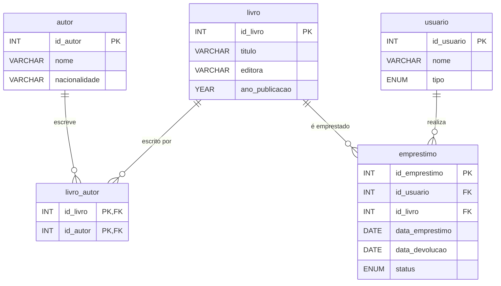

# Aula 1 — 23/02/2026

## Tema: Criação do Banco de Dados e Modelagem de Tabelas

---

### 📌 Objetivos da Aula
- Criar o banco de dados `AulaBDII`
- Modelar e criar tabelas com diferentes tipos de relacionamento
- Aplicar conceitos de chave primária, chave estrangeira, `AUTO_INCREMENT` e `ENUM`

---

### 🗂️ Tabelas Criadas

| Tabela | Descrição |
|---|---|
| `autor` | Armazena autores com nome e nacionalidade |
| `livro` | Armazena livros com título, editora e ano de publicação |
| `usuario` | Armazena usuários diferenciados por tipo (`aluno` ou `professor`) |
| `emprestimo` | Registra empréstimos de livros, com status (`ativo`, `devolvido`, `atrasado`) |
| `livro_autor` | Tabela associativa para o relacionamento N:M entre livros e autores |

---

### 🔗 Relacionamentos

- **`usuario` → `emprestimo`**: 1:N (um usuário pode ter vários empréstimos)
- **`livro` → `emprestimo`**: 1:N (um livro pode ser emprestado várias vezes)
- **`livro` ↔ `autor`**: N:M (um livro pode ter vários autores e vice-versa, via tabela `livro_autor`)

---

### 📊 Diagrama EER

---

### 📝 Conceitos Abordados

1. **`AUTO_INCREMENT`** — Geração automática de IDs sequenciais para chaves primárias
2. **`ENUM`** — Tipo de dado que restringe os valores possíveis de uma coluna (ex: `'aluno'`, `'professor'`)
3. **Chave Primária Composta** — Usada na tabela `livro_autor` com `PRIMARY KEY (id_livro, id_autor)`
4. **Chave Estrangeira (`FOREIGN KEY`)** — Garante integridade referencial entre tabelas
5. **Tabela Associativa** — Resolve relacionamentos N:M criando uma tabela intermediária

---

### 📂 Scripts da Aula

| Arquivo | Descrição |
|---|---|
| [`01_criacao_biblioteca.sql`](01_criacao_biblioteca.sql) | Criação do banco `AulaBDII` e das tabelas do sistema de biblioteca |
| [`diagrama_eer_biblioteca.mwb`](diagrama_eer_biblioteca.mwb) | Diagrama EER gerado no MySQL Workbench |
